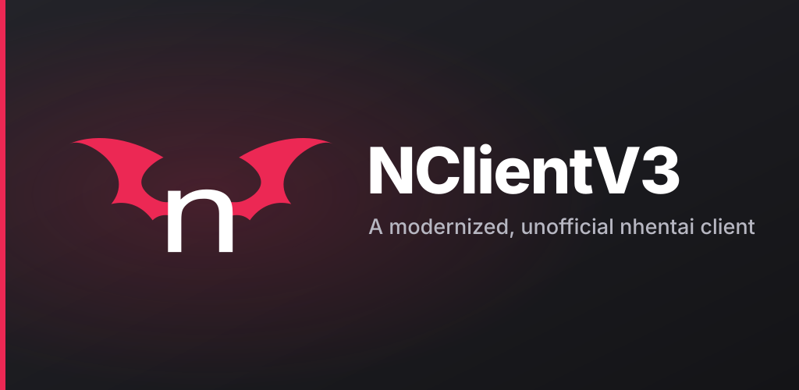
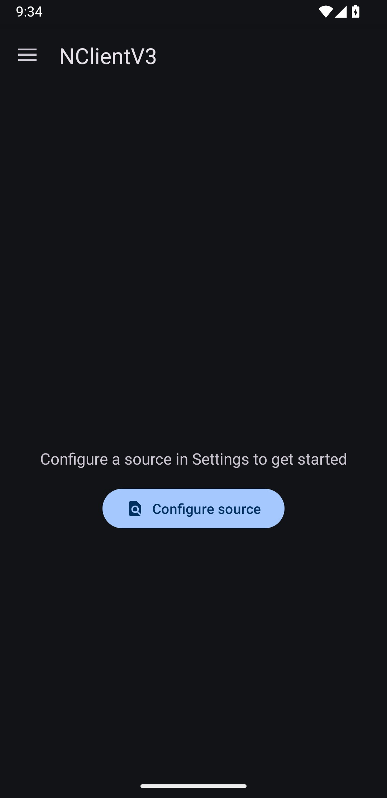
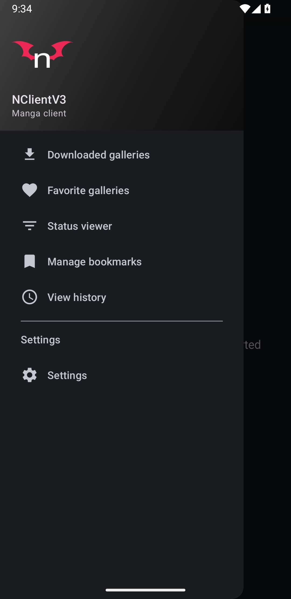
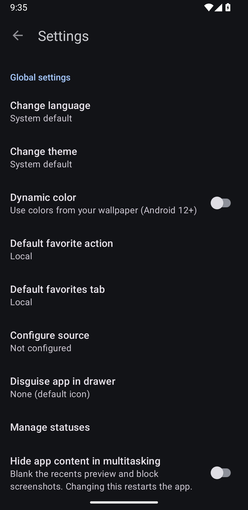
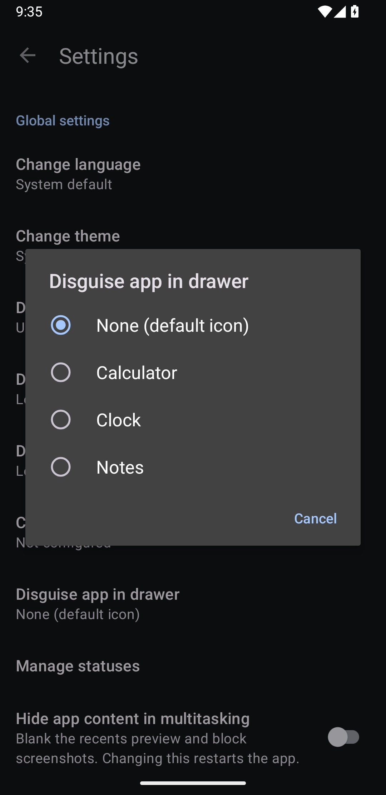

<p align="center">
  
</p>

<p align="center">
  A modernized, unofficial nhentai client for Android.<br>
  Forked from <a href="https://github.com/Dar9586/NClientV2">NClientV2</a> by Dar9586.
</p>
<p align="center">
  <a href="https://f-droid.org/packages/com.yosefario.nclientv3/"></a>
</p>
<p align="center">
  <a href="https://github.com/yosefario-dev/NClientV3/releases"></a>
  <a href="https://github.com/yosefario-dev/NClientV3/actions"></a>
  <a href="LICENSE"></a>
  
</p>

---

## Screenshots

<p align="center">
  
  
  
  
</p>

## Highlights

- **Material 3 throughout.** A consistent Material You redesign across every screen, with optional dynamic color (Android 12+) and a true-black AMOLED theme.
- **Works with current nhentai.** The v2 API, webp images, and a reworked sign-in flow with the Cloudflare Turnstile check.
- **Comments that work.** View, post, and delete your own comments, reachable from a button on the gallery page.
- **Privacy first.** Disguise the launcher icon, hide app content from recents and screenshots, lock the app with a PIN, and send no tracking or analytics.
- **Configurable source.** Pick your nhentai source or mirror in Settings.
- **Share into the app.** Send a link or text to NClientV3 to open that gallery or run a search.

## Features

**Browse and search**
- Browse and search galleries
- Search by tags with include and exclude filters
- Blur or hide excluded tags
- Random gallery discovery
- Open nhentai links or shared text directly in the app

**Reading and library**
- Download galleries for offline reading
- Local and online favorites in one tabbed screen
- Bookmarks and history
- Grid view that fills page thumbnails to the edges when the ratio fits

**Account and comments**
- Reworked login screen and sign-in flow
- View, post, and delete your own comments

**Privacy**
- Disguise the app icon as a Calculator, Clock, or Notes
- Hide app content in recents and block screenshots
- PIN lock
- No tracking or crash reporting

**Appearance**
- Material You dynamic colors (Android 12+)
- Optional true-black AMOLED theme
- Available in multiple languages (EN, FR, IT, TR, ZH, DE, ES, JA, RU, UK, AR)

## Download

Get it on [F-Droid](https://f-droid.org/packages/com.yosefario.nclientv3/), or grab the latest APK from [Releases](https://github.com/yosefario-dev/NClientV3/releases).

The app also has a built-in updater that checks for new releases on startup.

## Building from source

```bash
git clone https://github.com/yosefario-dev/NClientV3.git
cd NClientV3
./gradlew assembleDebug
```

The debug APK will be at `app/build/outputs/apk/debug/app-debug.apk`.

## Libraries

| Library | License |
|---------|---------|
| [Material Components](https://github.com/material-components/material-components-android) | Apache 2.0 |
| [OkHttp](https://github.com/square/okhttp) | Apache 2.0 |
| [Glide](https://github.com/bumptech/glide) | BSD/MIT/Apache |
| [JSoup](https://github.com/jhy/jsoup) | MIT |
| [PhotoView](https://github.com/chrisbanes/PhotoView) | Apache 2.0 |
| [PersistentCookieJar](https://github.com/franmontiel/PersistentCookieJar) | Apache 2.0 |

## Credits

NClientV3 is a fork of [NClientV2](https://github.com/Dar9586/NClientV2). Huge thanks to the original contributors:

- [Dar9586](https://github.com/Dar9586), original author
- [Still34](https://github.com/Still34), code cleanup and Traditional Chinese
- [TacoTheDank](https://github.com/TacoTheDank), XML and Gradle cleanup
- [hmaltr](https://github.com/hmaltr), Turkish translation
- [chayleaf](https://github.com/chayleaf), Cloudflare bypass
- And [many more](https://github.com/Dar9586/NClientV2#contributors)

## License

```text
Copyright 2021 Dar9586
Copyright 2026 yosefario-dev

Licensed under the Apache License, Version 2.0 (the "License");
you may not use this file except in compliance with the License.
You may obtain a copy of the License at

    http://www.apache.org/licenses/LICENSE-2.0

Unless required by applicable law or agreed to in writing, software
distributed under the License is distributed on an "AS IS" BASIS,
WITHOUT WARRANTIES OR CONDITIONS OF ANY KIND, either express or implied.
See the License for the specific language governing permissions and
limitations under the License.
```
